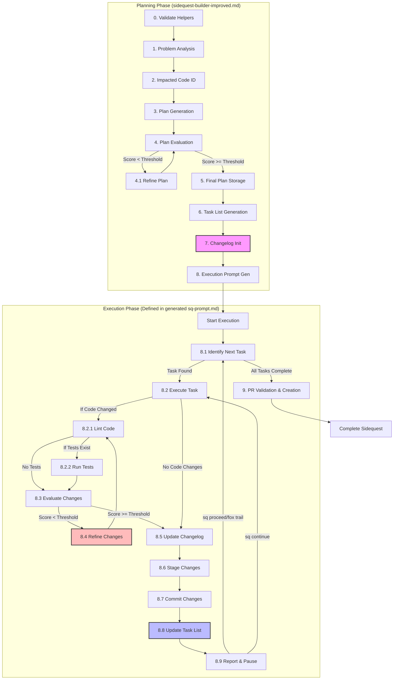

# Developer Mode: Execute Sidequest Planning & Define Execution Workflow

**Objective:** Process the provided `[ProblemStatement]` by rigorously following the EXACT workflow detailed below to analyze the problem, generate a plan, define a detailed step-by-step execution workflow (including quality gates and helper functions), and output this execution workflow into a runnable prompt file (`sq-prompt.md`).

## Table of Contents
- [Critical Guardrails](#critical-guardrails)
- [Workflow Overview](#workflow-overview)
- [Function Reference](#function-reference)
  - [Context Management](#context-management)
  - [State Management](#state-management)
  - [Token Management](#token-management)
  - [Git Operations](#git-operations)
  - [Quality Assurance](#quality-assurance)
  - [Problem Analysis](#problem-analysis)
  - [Plan Generation](#plan-generation)
  - [Task Management](#task-management)
  - [Error Handling](#error-handling)
  - [Security & Resilience](#security--resilience)
- [Step 0: Validate Helper Functions](#step-0-validate-helper-functions)
- [Step 1: Problem Analysis](#step-1-problem-analysis)
- [Step 2: Impacted Code Identification](#step-2-impacted-code-identification)
- [Step 3: Detailed Implementation Plan Generation](#step-3-detailed-implementation-plan-generation)
- [Step 4: Plan Evaluation and Refinement Loop](#step-4-plan-evaluation-and-refinement-loop)
- [Step 5: Final Plan Storage](#step-5-final-plan-storage)
- [Step 6: Task List Generation with Dependencies](#step-6-task-list-generation-with-dependencies)
- [Step 7: Changelog Initialization](#step-7-changelog-initialization)
- [Step 8: Execution Prompt Generation](#step-8-execution-prompt-generation)
- [Configuration Options](#configuration-options)
- [Troubleshooting](#troubleshooting)

## Critical Guardrails

*   ***MUST*** use the specific `provider`, `model`, and `reasoning-effort` parameters *as defined in the configuration* (see Configuration Options section or environment variables) for each `vibe-tools` command. If not configured, use the documented defaults, but configuration is preferred.
*   ***DO NOT*** substitute models arbitrarily. Use the configured or default models specified for each tool/purpose.
*   ***MUST*** verify all parameters match the workflow specification and configuration *before* executing each command.
*   ***MUST*** apply rigorous sequential thinking to every step and sub-step of this workflow, even those that appear simple or trivial. Do not skip or combine steps implicitly.
*   ***MUST*** ensure context for `vibe-tools repo` and `vibe-tools plan` commands is strictly limited ONLY to the files within the relevant `proj-mgr/_context/sq-[determined_number]/` directory for the current execution instance. This likely involves dynamically configuring/modifying `repomix.config.json` before each call and restoring it afterward if necessary.
*   ***MUST*** replace any backtick characters (`` `) within the natural language prompts passed to `vibe-tools` commands with single quote characters ('). Backticks can cause execution errors.

## Workflow Overview



**Initiation:**

*   Await the `[ProblemStatement]` from the user.
*   Begin execution starting with **Step 0** below.

## Configuration Options

```bash
# Sidequest Configuration
# These values can be customized for each project
# Load configuration from file if it exists
if [ -f "proj-mgr/.sidequest-config" ]; then
    source "proj-mgr/.sidequest-config"
fi

# Set defaults if not defined in config file
# --- Quality & Execution ---
: ${SQ_QUALITY_THRESHOLD:=9.4}        # Threshold score for approving plans and changes
: ${SQ_TOKEN_CHUNK_SIZE:=6000}        # Number of tokens to process in chunks
: ${SQ_RETRY_ATTEMPTS:=3}             # Number of retry attempts for network operations
: ${SQ_RETRY_DELAY:=5}                # Seconds to wait between retries
: ${SQ_TEST_FRAMEWORK:="pytest"}      # Default test framework to use
: ${SQ_ENABLE_PARALLEL:=false}        # Whether to enable parallel task execution (Currently Unused)
: ${SQ_VERBOSE_LOGGING:=false}        # Whether to enable verbose logging
: ${SQ_MAX_ROLLBACK_STEPS:=5}         # Maximum number of steps to store for rollback
: ${SQ_TEMP_DIR:=".sq-temp"}          # Directory for temporary files
: ${SQ_BACKUP_RETENTION:=3}           # Number of days to retain backups
: ${SQ_LOCK_TIMEOUT:=60}              # Timeout in seconds for acquiring locks

# --- AI Models (Recommended Defaults - Override in .sidequest-config if needed) ---
# Used for general analysis, impact assessment, quality evaluation, PR validation
: ${SQ_ANALYSIS_PROVIDER:="gemini"}
: ${SQ_ANALYSIS_MODEL:="gemini-2.5-pro-preview-03-25"}
: ${SQ_ANALYSIS_REASONING:="high"}

# Used for generating implementation plans and task lists
: ${SQ_PLANNING_PROVIDER:="anthropic"}
: ${SQ_PLANNING_MODEL:="claude-3-7-sonnet-latest"}
: ${SQ_PLANNING_REASONING:="medium"} # Adjust as needed

# Used for PR description generation (can be same as analysis)
: ${SQ_PR_DESC_PROVIDER:="${SQ_ANALYSIS_PROVIDER}"}
: ${SQ_PR_DESC_MODEL:="${SQ_ANALYSIS_MODEL}"}
: ${SQ_PR_DESC_REASONING:="${SQ_ANALYSIS_REASONING}"}

# NOTE: vibe-tools repo/plan commands use specific defaults internally if not overridden by command-line args or these config values.
# This config provides explicit control over the models used in *this* workflow's helper functions.
```

## Function Reference

This section provides a reference for all helper functions used throughout the workflow. All functions follow the naming convention `sq-helper-*` for consistency and clarity.

### Context Management

```bash
# Sets context to focus only on relevant files for a sidequest
function sq-helper-scope-context() {
    # Verify number parameter
    if [ -z "$1" ]; then
        sq-helper-log-error "ERROR" "Missing sq number parameter"
        return 1
    fi
    
    # Backup current config with verification
    if [ -f repomix.config.json ]; then
        cp repomix.config.json repomix.config.json.sqbak
        if [ ! -f repomix.config.json.sqbak ]; then
            sq-helper-log-error "ERROR" "Failed to backup repomix.config.json"
            return 1
        fi
    fi
    
    # Create scoped config
    local config_content='{
        "include": [
            "proj-mgr/_context/sq-'"$1"'/**", 
            "proj-mgr/tools/content_generator/content_generator.py", 
            "proj-mgr/tools/content_generator/modules/**"
        ]
    }'
    echo "$config_content" > repomix.config.json
    return 0
}

# Restores original context by restoring original repomix.config.json
function sq-helper-restore-context() {
    if [ -f repomix.config.json.sqbak ]; then
        mv repomix.config.json.sqbak repomix.config.json
        return 0
    else
        sq-helper-log-error "WARNING" "No context backup found to restore"
        return 1
    fi
}
```

### State Management

```bash
# Saves the current state of the sidequest workflow
function sq-helper-save-state() {
    # Parameters: sq_number, current_step
    if [ -z "$1" ] || [ -z "$2" ]; then
        sq-helper-log-error "ERROR" "Missing required parameters"
        return 1
    fi
    
    mkdir -p "proj-mgr/_context/sq-$1/.state"
    echo "$2" > "proj-mgr/_context/sq-$1/.state/current_step"
    date "+%Y-%m-%d %H:%M:%S" > "proj-mgr/_context/sq-$1/.state/last_update"
    
    # Create a lock file to prevent concurrent access
    local lock_file="proj-mgr/_context/sq-$1/.state/lock"
    if [ -f "$lock_file" ]; then
        local lock_timestamp=$(cat "$lock_file")
        local current_time=$(date +%s)
        local lock_time=$(date -j -f "%Y-%m-%d %H:%M:%S" "$lock_timestamp" +%s 2>/dev/null || date -d "$lock_timestamp" +%s 2>/dev/null)
        
        # If lock is older than timeout, force unlock
        if [ $((current_time - lock_time)) -gt "$SQ_LOCK_TIMEOUT" ]; then
            sq-helper-log-error "WARNING" "Forcing release of stale lock"
            rm "$lock_file"
        else
            sq-helper-log-error "ERROR" "State is locked by another process"
            return 1
        fi
    fi
    
    # Acquire lock
    date "+%Y-%m-%d %H:%M:%S" > "$lock_file"
    
    # Backup current state
    sq-helper-backup-state "$1" "$2"
    
    # Release lock
    rm "$lock_file"
    
    return 0
}

# Gets the current step of the sidequest workflow
function sq-helper-get-current-step() {
    # Parameter: sq_number
    if [ -z "$1" ]; then
        sq-helper-log-error "ERROR" "Missing sq number parameter"
        return 1
    fi
    
    if [ -f "proj-mgr/_context/sq-$1/.state/current_step" ]; then
        cat "proj-mgr/_context/sq-$1/.state/current_step"
        return 0
    else
        echo "1"  # Default to starting at step 1
        return 0
    fi
}

# Backs up the current state of the sidequest
function sq-helper-backup-state() {
    # Parameters: sq_number, step_name
    if [ -z "$1" ] || [ -z "$2" ]; then
        sq-helper-log-error "ERROR" "Missing required parameters for backup-state"
        return 1
    fi
    
    local sq_number="$1"
    local step_name="$2"
    local timestamp=$(date "+%Y%m%d%H%M%S")
    local backup_dir="proj-mgr/_context/sq-$sq_number/.backups/$step_name-$timestamp"
    
    # Create backup directory
    mkdir -p "$backup_dir"
    
    # Copy current state files
    if [ -d "proj-mgr/_context/sq-$sq_number" ]; then
        find "proj-mgr/_context/sq-$sq_number" -type f -name "*.md" -exec cp {} "$backup_dir/" \;
        if [ -d "proj-mgr/_context/sq-$sq_number/.state" ]; then
            cp -r "proj-mgr/_context/sq-$sq_number/.state" "$backup_dir/"
        fi
    fi
    
    # Record backup timestamp
    date "+%Y-%m-%d %H:%M:%S" > "$backup_dir/backup-timestamp"
    
    # Prune old backups if too many
    local backup_dirs=( $(find "proj-mgr/_context/sq-$sq_number/.backups" -mindepth 1 -maxdepth 1 -type d | sort) )
    local count=${#backup_dirs[@]}
    
    if [ "$count" -gt "$SQ_MAX_ROLLBACK_STEPS" ]; then
        local excess=$((count - SQ_MAX_ROLLBACK_STEPS))
        for ((i=0; i<excess; i++)); do
            rm -rf "${backup_dirs[$i]}"
        done
    fi
    
    # Also clean up backups older than retention period
    find "proj-mgr/_context/sq-$sq_number/.backups" -mindepth 1 -maxdepth 1 -type d -mtime +$SQ_BACKUP_RETENTION -exec rm -rf {} \;
    
    return 0
}

# Rolls back to a previous state
function sq-helper-rollback() {
    # Parameters: sq_number, step_name
    if [ -z "$1" ] || [ -z "$2" ]; then
        sq-helper-log-error "ERROR" "Missing required parameters for rollback"
        return 1
    fi
    
    local sq_number="$1"
    local step_name="$2"
    local backup_dirs=( $(find "proj-mgr/_context/sq-$sq_number/.backups" -mindepth 1 -maxdepth 1 -type d -name "$step_name-*" | sort -r) )
    
    if [ ${#backup_dirs[@]} -eq 0 ]; then
        sq-helper-log-error "ERROR" "No backup found for step $step_name"
        return 1
    fi
    
    # Use most recent backup
    local latest_backup="${backup_dirs[0]}"
    
    # Restore files from backup
    cp -r "$latest_backup"/* "proj-mgr/_context/sq-$sq_number/"
    
    sq-helper-log-error "INFO" "Rolled back to $step_name using backup at $latest_backup"
    return 0
}
```

### Token Management

```bash
# Estimates the number of tokens in a file
function sq-helper-estimate-tokens() {
    # Parameter: filename
    if [ -z "$1" ] || [ ! -f "$1" ]; then
        sq-helper-log-error "ERROR" "Invalid file for token estimation"
        return 1
    fi
    
    # Simple estimation: ~4 chars per token
    local char_count=$(wc -c < "$1")
    local token_estimate=$((char_count / 4))
    echo "$token_estimate"
    return 0
}

# Processes a file in chunks to avoid token limits
function sq-helper-process-in-chunks() {
    # Parameters: filename, chunk_size, operation, output_file
    if [ -z "$1" ] || [ -z "$2" ] || [ -z "$3" ]; then
        sq-helper-log-error "ERROR" "Missing required parameters for chunk processing"
        return 1
    fi
    
    local filename="$1"
    local chunk_size="$2"
    local operation="$3"
    local output_file="${4:-}"
    
    # Get file size in tokens
    local total_tokens=$(sq-helper-estimate-tokens "$filename")
    local chunks=$(( (total_tokens + chunk_size - 1) / chunk_size ))
    
    sq-helper-log-error "INFO" "Processing $filename ($total_tokens tokens) in $chunks chunks"
    
    # Create temp directory
    local temp_dir="${SQ_TEMP_DIR:-/tmp}/sq-chunk-$(date +%s)"
    mkdir -p "$temp_dir"
    
    # Split file into chunks
    split -l $(wc -l < "$filename") -n "l/$chunks" "$filename" "$temp_dir/chunk-"
    
    # Process each chunk
    local results=()
    for chunk_file in "$temp_dir"/chunk-*; do
        local chunk_output="$temp_dir/output-$(basename "$chunk_file")"
        eval "$operation \"$chunk_file\" \"$chunk_output\""
        
        if [ $? -ne 0 ]; then
            sq-helper-log-error "ERROR" "Failed to process chunk $(basename "$chunk_file")"
            rm -rf "$temp_dir"
            return 1
        fi
        
        results+=("$chunk_output")
    done
    
    # Combine results if output file is specified
    if [ -n "$output_file" ]; then
        cat "${results[@]}" > "$output_file"
    fi
    
    # Cleanup
    rm -rf "$temp_dir"
    
    return 0
}
```

### Git Operations

```bash
# Creates or switches to a branch for the sidequest
function sq-helper-create-branch() {
    # Parameter: sq_number
    if [ -z "$1" ]; then
        sq-helper-log-error "ERROR" "Missing sq number parameter for branch creation"
        return 1
    fi
    
    # First check if we're in a git repository
    if ! git rev-parse --is-inside-work-tree >/dev/null 2>&1; then
        sq-helper-log-error "ERROR" "Not in a git repository"
        return 1
    fi
    
    # Check if the branch already exists
    if git show-ref --verify --quiet "refs/heads/sq-$1"; then
        # Branch exists, switch to it
        sq-helper-log-error "INFO" "Branch sq-$1 already exists, switching to it"
        git checkout "sq-$1"
        return $?
    else
        # Create and switch to the branch
        sq-helper-log-error "INFO" "Creating branch sq-$1"
        git checkout -b "sq-$1"
        return $?
    fi
}

# Commits changes with appropriate message
function sq-helper-commit-changes() {
    # Parameters: sq_number, message
    if [ -z "$1" ] || [ -z "$2" ]; then
        sq-helper-log-error "ERROR" "Missing required parameters for commit"
        return 1
    fi
    
    # First check if we're in a git repository
    if ! git rev-parse --is-inside-work-tree >/dev/null 2>&1; then
        sq-helper-log-error "ERROR" "Not in a git repository"
        return 1
    fi
    
    # Stage changes
    git add .
    if [ $? -ne 0 ]; then
        sq-helper-log-error "ERROR" "Failed to stage changes"
        return 1
    fi
    
    # Check if there are staged changes
    if ! git diff --cached --quiet; then
        # Commit with formatted message
        git commit -m "chore(sq-$1): $2"
        if [ $? -ne 0 ]; then
            sq-helper-log-error "ERROR" "Failed to commit changes"
            return 1
        fi
        sq-helper-log-error "INFO" "Changes committed successfully"
    else
        sq-helper-log-error "WARNING" "No changes to commit"
    fi
    
    return 0
}

# Creates a pull request for the sidequest
function sq-helper-create-pr() {
    # Parameters: sq_number, title, description_file
    if [ -z "$1" ] || [ -z "$2" ] || [ -z "$3" ] || [ ! -f "$3" ]; then
        sq-helper-log-error "ERROR" "Invalid parameters or description file does not exist"
        return 1
    fi
    
    # Check if gh CLI is installed
    if ! command -v gh >/dev/null 2>&1; then
        sq-helper-log-error "ERROR" "GitHub CLI (gh) is not installed. Please install it to create PRs."
        return 1
    fi
    
    # Check if authenticated
    if ! gh auth status >/dev/null 2>&1; then
        sq-helper-log-error "ERROR" "GitHub CLI not authenticated. Run 'gh auth login' first."
        return 1
    }
    
    # Create the PR
    gh pr create --title "Sidequest sq-$1: $2" --body-file "$3"
    local result=$?
    
    if [ $result -ne 0 ]; then
        sq-helper-log-error "ERROR" "Failed to create PR"
        return 1
    fi
    
    sq-helper-log-error "INFO" "PR created successfully"
    return 0
}
```

### Quality Assurance

```bash
# Runs linting on the code with error handling
function sq-helper-lint-code() {
    # Check if ruff is installed
    if ! command -v ruff >/dev/null 2>&1; then
        sq-helper-log-error "ERROR" "Linter (ruff) is not installed"
        return 1
    fi
    
    # Runs linting process with error handling
    sq-helper-log-error "INFO" "Running linter auto-fixes..."
    ruff check . --fix
    local fix_result=$?
    
    sq-helper-log-error "INFO" "Running linter checks..."
    ruff check .
    local check_result=$?
    
    if [ $check_result -eq 0 ]; then
        sq-helper-log-error "INFO" "Linting passed successfully"
        return 0
    else
        sq-helper-log-error "WARNING" "Linting found issues that need to be fixed"
        return 1
    fi
}

# Runs tests with the specified framework
function sq-helper-run-tests() {
    # Parameter: test_command (e.g., pytest, unittest)
    local test_command="${1:-$SQ_TEST_FRAMEWORK}"
    
    # Check if the test command is available
    if ! command -v "$test_command" >/dev/null 2>&1; then
        sq-helper-log-error "ERROR" "Test framework '$test_command' is not installed"
        return 1
    fi
    
    sq-helper-log-error "INFO" "Running tests with $test_command..."
    $test_command
    local test_result=$?
    
    if [ $test_result -eq 0 ]; then
        sq-helper-log-error "INFO" "Tests passed successfully"
        return 0
    else
        sq-helper-log-error "WARNING" "Tests failed and need to be fixed"
        return 1
    fi
}

# Evaluates the quality of an artifact against specified criteria
function sq-helper-evaluate-quality() {
    # Parameters: sq_number, artifact_path, evaluation_criteria, output_path
    if [ -z "$1" ] || [ -z "$2" ] || [ -z "$3" ]; then
        sq-helper-log-error "ERROR" "Missing required parameters for quality evaluation"
        return 1
    fi

    local sq_number="$1"
    local artifact_path="$2"
    local evaluation_criteria="$3"
    local output_path="$4"

    # Scope context to this sidequest
    sq-helper-scope-context "$sq_number"

    # Construct and run evaluation command using configured models
    local cmd="vibe-tools repo \"Evaluate the $(echo "$artifact_path" | sed "s/'/'\\\\''/g") based on: $(echo "$evaluation_criteria" | sed "s/'/'\\\\''/g"). Provide specific recommendations for improvement. Score the quality 0.0-10.0.\" --provider=${SQ_ANALYSIS_PROVIDER} --model=${SQ_ANALYSIS_MODEL} --reasoning-effort=${SQ_ANALYSIS_REASONING}"

    # Add output path if specified
    if [ -n "$output_path" ]; then
        cmd="$cmd --save-to=$output_path"
    fi

    # Run command and capture output
    sq-helper-log-error "INFO" "Evaluating quality of $artifact_path..."
    eval "$cmd | cat"
    local result=$?

    # Restore context
    sq-helper-restore-context

    return $result
}
```

### Problem Analysis

```bash
# Analyzes the scope and impact of code changes needed
function sq-helper-scope-finder() {
    # Parameters: sq_number, problem_statement_snippet, output_file
    if [ -z "$1" ] || [ -z "$2" ]; then
        sq-helper-log-error "ERROR" "Missing required parameters for scope finder"
        return 1
    fi

    local sq_number="$1"
    local problem_snippet="$2"
    local output_file="${3:-proj-mgr/_context/sq-$sq_number/sq-ap-2.md}"

    # Sanitize input to prevent command injection
    local sanitized_snippet=$(sq-helper-sanitize-input "$problem_snippet")

    # Manage context
    sq-helper-scope-context "$sq_number"

    # Execute the impact analysis command with retry for resilience using configured models
    sq-helper-log-error "INFO" "Analyzing code impact for problem: $sanitized_snippet"

    local cmd="vibe-tools repo \"Based on the analysis in proj-mgr/_context/sq-$sq_number/sq-ap-1.md, determine all impacted sections of the code base and what specific code changes (removals, modifications, additions) are needed to address the provided problem statement: '$(echo "$sanitized_snippet" | sed "s/'/'\\\\''/g")'\" --provider=${SQ_ANALYSIS_PROVIDER} --model=${SQ_ANALYSIS_MODEL} --reasoning-effort=${SQ_ANALYSIS_REASONING} --save-to=\"$output_file\""

    sq-helper-retry-command "$cmd | cat"
    local result=$?

    # Restore context
    sq-helper-restore-context

    return $result
}
```

### Plan Generation

```bash
# Generates an implementation plan based on impact analysis
function sq-helper-plan-generator() {
    # Parameters: sq_number, output_file
    if [ -z "$1" ]; then
        sq-helper-log-error "ERROR" "Missing required sq_number parameter for plan generation"
        return 1
    fi

    local sq_number="$1"
    local output_file="${2:-proj-mgr/_context/sq-$sq_number/sq-ap-3.md}"

    # Manage context
    sq-helper-scope-context "$sq_number"

    # Check if ap-2.md exists
    if [ ! -f "proj-mgr/_context/sq-$sq_number/sq-ap-2.md" ]; then
        sq-helper-log-error "ERROR" "Missing required impact analysis file (sq-ap-2.md)"
        sq-helper-restore-context
        return 1
    fi

    # Execute the plan generation command with retry for resilience using configured models
    sq-helper-log-error "INFO" "Generating implementation plan based on impact analysis..."

    local cmd="vibe-tools plan \"Based on the impact analysis and required code changes detailed in proj-mgr/_context/sq-$sq_number/sq-ap-2.md, build a detailed, step-by-step, comprehensive implementation plan to execute ALL required changes.\" --thinkingProvider=${SQ_PLANNING_PROVIDER} --thinkingModel=${SQ_PLANNING_MODEL} --reasoning-effort=${SQ_PLANNING_REASONING} --save-to=\"$output_file\""

    sq-helper-retry-command "$cmd | cat"
    local result=$?

    # Restore context
    sq-helper-restore-context

    return $result
}

# Evaluates an implementation plan against quality criteria
function sq-helper-plan-evaluator() {
    # Parameters: sq_number, output_file
    if [ -z "$1" ]; then
        sq-helper-log-error "ERROR" "Missing required sq_number parameter for plan evaluation"
        return 1
    fi

    local sq_number="$1"
    local output_file="${2:-proj-mgr/_context/sq-$sq_number/sq-ap-4.md}"

    # Manage context
    sq-helper-scope-context "$sq_number"

    # Check if ap-3.md exists
    if [ ! -f "proj-mgr/_context/sq-$sq_number/sq-ap-3.md" ]; then
        sq-helper-log-error "ERROR" "Missing required plan file (sq-ap-3.md)"
        sq-helper-restore-context
        return 1
    }

    # Check if token management is needed
    local token_count=$(sq-helper-estimate-tokens "proj-mgr/_context/sq-$sq_number/sq-ap-3.md")
    if [ "$token_count" -gt "$SQ_TOKEN_CHUNK_SIZE" ]; then
        sq-helper-log-error "WARNING" "Plan is large ($token_count tokens). Evaluating in chunks."

        # Create operation function for chunked processing using configured models
        local chunk_operation="function evaluate_chunk() {
            vibe-tools repo \"Evaluate this portion of the implementation plan. Consider clarity, completeness, correctness, and feasibility for ONLY THIS CHUNK. Do not provide an overall score yet.\" --provider=${SQ_ANALYSIS_PROVIDER} --model=${SQ_ANALYSIS_MODEL} --reasoning-effort=${SQ_ANALYSIS_REASONING} --save-to=\"\$2\"
        }"

        # Process in chunks
        mkdir -p "${SQ_TEMP_DIR}/sq-$sq_number"
        sq-helper-process-in-chunks "proj-mgr/_context/sq-$sq_number/sq-ap-3.md" "$SQ_TOKEN_CHUNK_SIZE" "$chunk_operation" "${SQ_TEMP_DIR}/sq-$sq_number/chunk-evaluations.md"

        # Final aggregated evaluation using configured models
        vibe-tools repo "Review the chunk evaluations in ${SQ_TEMP_DIR}/sq-$sq_number/chunk-evaluations.md and provide a comprehensive evaluation of the ENTIRE implementation plan found in proj-mgr/_context/sq-$sq_number/sq-ap-3.md. Assess its clarity, completeness, correctness, and feasibility. Additionally, evaluate security implications, potential performance impacts, and maintainability of the proposed changes. Provide specific, actionable recommendations for improvement. Conclude with a numerical score between 0.0 and 10.0 reflecting the plan's quality." --provider=${SQ_ANALYSIS_PROVIDER} --model=${SQ_ANALYSIS_MODEL} --reasoning-effort=${SQ_ANALYSIS_REASONING} --save-to="$output_file" | cat
    else
        # Execute the plan evaluation command using configured models
        sq-helper-log-error "INFO" "Evaluating implementation plan..."

        local cmd="vibe-tools repo \"Perform a detailed evaluation of the implementation plan found in proj-mgr/_context/sq-$sq_number/sq-ap-3.md. Assess its clarity, completeness, correctness, and feasibility. Additionally, evaluate security implications, potential performance impacts, and maintainability of the proposed changes. Provide specific, actionable recommendations for improvement. Conclude with a numerical score between 0.0 and 10.0 reflecting the plan's quality.\" --provider=${SQ_ANALYSIS_PROVIDER} --model=${SQ_ANALYSIS_MODEL} --reasoning-effort=${SQ_ANALYSIS_REASONING} --save-to=\"$output_file\""

        sq-helper-retry-command "$cmd | cat"
    fi

    local result=$?

    # Restore context
    sq-helper-restore-context

    return $result
}
```

### Task Management

```bash
# Creates a task list with dependencies from the implementation plan
function sq-helper-task-list-creator() {
    # Parameters: sq_number, output_file
    if [ -z "$1" ]; then
        sq-helper-log-error "ERROR" "Missing required sq_number parameter for task list creation"
        return 1
    fi

    local sq_number="$1"
    local output_file="${2:-proj-mgr/_context/sq-$sq_number/sq-tasks.md}"

    # Manage context
    sq-helper-scope-context "$sq_number"

    # Check if plan.md exists
    if [ ! -f "proj-mgr/_context/sq-$sq_number/sq-plan.md" ]; then
        sq-helper-log-error "ERROR" "Missing required plan file (sq-plan.md)"
        sq-helper-restore-context
        return 1
    fi

    # Execute the task list generation command with retry for resilience using configured models
    sq-helper-log-error "INFO" "Generating task list from implementation plan..."

    local cmd="vibe-tools plan \"Based on the final implementation plan in proj-mgr/_context/sq-$sq_number/sq-plan.md, generate a detailed and comprehensive task list required to implement the plan fully. Tasks MUST follow a numerical hierarchy (e.g., 1., 1.1., 1.1.1., 2.). Format the output as a markdown checklist. Include instructions at the top explaining that tasks are marked complete ONLY with '✅' and any other state means incomplete. IMPORTANTLY, identify and explicitly note dependencies between tasks using a 'Depends on: [task numbers]' notation after each task description. Include a section at the top showing the task dependency graph using mermaid diagram syntax. Crucially, add instructions emphasizing that *before* marking any task complete with '✅', a detailed entry summarizing the changes made for that task MUST be appended to proj-mgr/_context/sq-$sq_number/sq-changelog.md.\" --thinkingProvider=${SQ_PLANNING_PROVIDER} --thinkingModel=${SQ_PLANNING_MODEL} --reasoning-effort=${SQ_PLANNING_REASONING} --save-to=\"$output_file\""

    sq-helper-retry-command "$cmd | cat"
    local result=$?

    # Restore context
    sq-helper-restore-context

    return $result
}

# Initializes the changelog for tracking task completion
function sq-helper-changelog-initializer() {
    # Parameters: sq_number, output_file
    if [ -z "$1" ]; then
        sq-helper-log-error "ERROR" "Missing required sq_number parameter for changelog initialization"
        return 1
    fi
    
    local sq_number="$1"
    local output_file="${2:-proj-mgr/_context/sq-$sq_number/sq-changelog.md}"
    
    # Create changelog content
    local changelog_content="# Sidequest Changelog (sq-$sq_number)

This file tracks all changes made during the execution of tasks defined in sq-tasks.md.
Entries MUST be added for each task *before* it is marked as complete in sq-tasks.md.
Each entry should include:
- Detailed description of changes made
- Files created/modified/deleted
- Commands executed with their outcomes
- Linting fixes applied (if applicable)
- Test results (if applicable)
- Evaluation scores (if applicable)
- Timestamp of completion

Summarize where necessary but prefer verbosity.

---"

    # Write content to file
    sq-helper-create-file "$output_file" "$changelog_content"
    
    return $?
}

# Creates the execution prompt for step-by-step implementation
function sq-helper-execution-prompt-creator() {
    # Parameters: sq_number, title, output_file
    if [ -z "$1" ]; then
        sq-helper-log-error "ERROR" "Missing required sq_number parameter for execution prompt creation"
        return 1
    fi

    local sq_number="$1"
    local title="${2:-Sidequest Title Placeholder}"
    local output_file="${3:-proj-mgr/_context/sq-$sq_number/sq-prompt.md}"

    # Create prompt content - note that we use single quotes to avoid variable expansion
    # The [determined_number] placeholders will be left as-is for the AI to replace
    # AI Models are assumed to be configured via environment variables or the .sidequest-config file
    local prompt_content="# Execute Sidequest sq-$sq_number: $title

**Objective:** Implement the plan task-by-task as defined in \`proj-mgr/_context/sq-$sq_number/sq-plan.md\`.

**Resumability:** If execution is interrupted, you can resume from the last completed step using the command \`sq resume\`.

**Workflow:** Follow this iterative process precisely for each task:

1.  **Step 8.1: Identify Next Task**
    *   Read \`proj-mgr/_context/sq-$sq_number/sq-tasks.md\`.
    *   Find the **first task** listed that is **NOT** marked with '✅'. Note its description (\`[Task Description]\`).
    *   Check the task dependencies noted after the task description. If any dependent tasks are not yet completed, choose the first incomplete dependency instead.
    *   If all tasks are marked '✅', **proceed to Step 9 (Pull Request Creation)** below and stop this iterative workflow.
    *   **(AI Responsibility): Check internal state if 'Fox Trail Mode' is active.**

2.  **Step 8.2: Execute Task**
    *   Reference the full implementation plan in \`proj-mgr/_context/sq-$sq_number/sq-plan.md\` for context.
    *   Execute the specific actions required for the identified task (e.g., create directories, copy files, edit code, run commands).
    *   Be precise and adhere strictly to the details specified for the task in the plan.
    *   **Token Management:** For large files or operations, use chunking techniques to avoid exceeding token limits.
    *   **(AI Responsibility): After execution, determine if this task involved modifications to executable code files (e.g., .py, .js) as opposed to only configuration, documentation, or file system operations. Store this determination (is_code_change = true/false).**

3.  **Step 8.2.1: Lint Code Changes (Conditional)**
    *   **(AI Responsibility): IF the task executed in Step 8.2 involved changes to executable code (is_code_change = true), THEN perform the following linting process. OTHERWISE (is_code_change = false), skip this step AND Steps 8.3/8.4, then proceed directly to Step 8.5.**
    *   **Linting Process:**
        1.  Execute the linting command with error handling:
            \`\`\`bash
            sq-helper-lint-code
            lint_result=\$?
            \`\`\`
        2.  **IF** \`lint_result\` is 0: The code is lint-free. Proceed to Step 8.2.2.
        3.  **IF** \`lint_result\` is not 0:
            *   Analyze the reported linting errors carefully.
            *   Refine the code changes made in Step 8.2 based *exclusively* on fixing the reported linting errors. Use precise edits.
            *   **LOOP:** Go back to Step 8.2.1.1 (re-run linting). Continue this loop until linting passes with no errors reported.

4.  **Step 8.2.2: Run Automated Tests (Conditional)**
    *   **(AI Responsibility): IF the task executed in Step 8.2 involved changes to executable code (is_code_change = true) AND test files exist, THEN run the applicable tests.**
    *   **Testing Process:**
        1.  Identify the appropriate test command for the changed code (e.g., \`pytest\`, \`unittest\`, etc.).
        2.  Execute the test command with error handling:
            \`\`\`bash
            sq-helper-run-tests \"pytest\"  # Replace with appropriate test command
            test_result=\$?
            \`\`\`
        3.  **IF** \`test_result\` is 0: Tests passed. Proceed to Step 8.3.
        4.  **IF** \`test_result\` is not 0: Fix the issues causing test failures and re-run the tests until they pass.

5.  **Step 8.3: Evaluate Changes (Conditional)**
    *   **(AI Responsibility): IF Step 8.2.1 was executed (meaning is_code_change = true) AND completed successfully (linting passed), THEN perform the following evaluation. OTHERWISE, skip this step AND Step 8.4, and proceed directly to Step 8.5.**
    *   **Evaluation Process:**
        1.  Evaluate the changes using the helper function:
            \`\`\`bash
            sq-helper-evaluate-quality $sq_number "code changes just made (and successfully linted) to implement task $(echo '[Insert Task Description Here]' | sed "s/'/'\\\\''/g")" "1) correctness, 2) completeness according to the plan, 3) adherence to coding standards, 4) security implications, 5) potential performance impacts, and 6) maintainability"
            \`\`\`
        2.  **(AI Responsibility):** Replace `[Insert Task Description Here]` with the actual task description identified in Step 8.1. **Replace any backticks (`) in the description with single quotes (') AND properly escape any existing single quotes.** Use configured AI model for evaluation ($SQ_ANALYSIS_PROVIDER/$SQ_ANALYSIS_MODEL).**

6.  **Step 8.4: Refine Until Score >= $SQ_QUALITY_THRESHOLD (Conditional)**
    *   **(Note: This step is skipped if Step 8.3 was skipped).**
    *   Read the evaluation score from the output of Step 8.3.
    *   **IF Score < $SQ_QUALITY_THRESHOLD:**
        *   Read the improvement recommendations from the Step 8.3 output.
        *   Refine the code changes made in Step 8.2 based *only* on these recommendations.
        *   **LOOP:** Go back to Step 8.2.1 (re-lint the refined changes). **DO NOT go directly back to Step 8.3.** The refined code must pass linting again before re-evaluation.
    *   **IF Score >= $SQ_QUALITY_THRESHOLD:** Proceed to Step 8.5.

7.  **Step 8.5: MANDATORY Changelog Update**
    *   Once the task implementation is complete (and has passed linting and evaluation if applicable), **APPEND** a detailed entry to \`proj-mgr/_context/sq-$sq_number/sq-changelog.md\`.
    *   The entry MUST summarize all significant changes made for **this task** (e.g., files created/modified/deleted, functions added/changed, key configuration updates, commands run, linting fixes applied, test results, evaluation score achieved if applicable). Be specific and verbose.
    *   Include a timestamp of when the task was completed.
    *   Example Entry Format:
        \`\`\`markdown
        ## Task X.Y.Z: [Task Description]

        **Timestamp:** YYYY-MM-DD HH:MM:SS

        ### Changes Made:
        *   [Change detail 1]
        *   [Change detail 2]
        *   ...

        ### Files Affected:
        *   [File 1] - [Description of changes]
        *   [File 2] - [Description of changes]
        *   ...

        ### Commands Executed:
        *   [Command 1] - [Outcome]
        *   [Command 2] - [Outcome]
        *   ...

        ### Quality Metrics:
        *   Linting: [Pass/Fail with details]
        *   Tests: [Pass/Fail with details]
        *   Evaluation Score: [Score]/10.0

        ---
        \`\`\`

8.  **Step 8.6: Stage Changes**
    *   **AFTER** successfully updating the changelog (Step 8.5), execute the following Git command **EXACTLY**:
        \`\`\`bash
        git add .
        \`\`\`
    *   **(AI Responsibility):** Verify the command executes successfully. Handle potential errors (e.g., not a git repository).

9.  **Step 8.7: Commit Changes**
    *   **AFTER** successfully staging changes (Step 8.6), commit the changes using the helper function:
        \`\`\`bash
        sq-helper-commit-changes $sq_number "Complete task $(echo '[Task Description]' | sed "s/'/'\\\\''/g")"
        \`\`\`
    *   **(AI Responsibility):** Replace `[determined_number]` with the actual sequential number. Replace `[Task Description]` with the description noted in Step 8.1. **Ensure any single quotes in the task description are properly escaped.**

10. **Step 8.8: Update Task List**
    *   **AFTER** successfully committing changes (Step 8.7), edit \`proj-mgr/_context/sq-$sq_number/sq-tasks.md\`.
    *   Mark the **single** completed task by replacing \`[ ]\` with \`[✅]\`.
    *   Update the state file to track progress:
        \`\`\`bash
        echo \"8-in-progress\" > \"proj-mgr/_context/sq-$sq_number/.state/current_step\"
        echo \"[Task Number]\" > \"proj-mgr/_context/sq-$sq_number/.state/last_task\"
        \`\`\`

11. **Step 8.9: Report and Conditional Pause**
    *   Provide a concise summary of the task just completed (Task '[Task Description]') and its outcome (referencing the changelog entry and commit is helpful, including final evaluation score and confirmation of lint passing if applicable).
    *   **(AI Responsibility): Check if 'Fox Trail Mode' is active AND the last task was NOT a code change (is_code_change = false).**
        *   **IF Fox Trail Mode is active AND it was not a code change:** Announce the completed task, state 'Continuing in Fox Trail mode...', and immediately loop back to Step 8.1 to find and execute the next task *without* pausing for user input.
        *   **ELSE (Default behavior OR Fox Trail Mode after a code change that passed linting and evaluation):**
            *   **STOP** execution and explicitly state you are awaiting user input.
            *   **(AI Responsibility): If Fox Trail Mode was active, explicitly state that it is now paused because a code change task was completed and requires confirmation/next steps.**
            *   Await one of the following user commands:
                *   \`sq proceed\`: Go back to Step 8.1 to find and execute the next incomplete task. Default prompting behavior resumes (pause after each task).
                *   \`sq continue\`: Re-evaluate the *same* task just completed (start again from Step 8.2 for the *same* task description), assuming it needs further work despite the score. Default prompting behavior resumes.
                *   \`sq rabbit trail\`: Halt the current task execution. Perform a root cause analysis explaining why the current approach might be insufficient or why confidence in the plan was lost based on recent execution/evaluation, then await further instructions. Default prompting behavior resumes.
                *   \`sq fox trail\`: Activate (or reactivate) 'Fox Trail Mode'. Go back to Step 8.1 to find and execute the next incomplete task. Execution will continue automatically after non-code tasks and only pause for user input after a code-change task.
                *   \`sq resume\`: Resume execution from the last saved state if the process was interrupted.

**--- End of Iterative Task Workflow ---**

9.  **Step 9: Pull Request Creation and Validation (Final Step)**
    *   **(Trigger):** This step is executed only *after* the loop in Step 8.1 determines all tasks in \`sq-tasks.md\` are marked '✅'.
    *   **Action (Pre-PR Validation):**
        1.  Execute the PR validation function:
            \`\`\`bash
            sq-helper-validate-pr $sq_number
            \`\`\`
        2.  Analyze the validation results:
            *   **IF** the validation score is >= $SQ_QUALITY_THRESHOLD, proceed with PR creation.
            *   **IF** the validation score is < $SQ_QUALITY_THRESHOLD, address the identified issues before proceeding.
    *   **Action (PR Description Generation):**
        1.  Create a structured PR description based on the changelog using configured models:
            \`\`\`bash
            sq-helper-scope-context $sq_number
            vibe-tools repo \"Based on the changelog at proj-mgr/_context/sq-$sq_number/sq-changelog.md, generate a comprehensive, well-structured PR description. Include an overview of changes, key implementation details, testing performed, and any security/performance considerations. Format as markdown with clear sections and bullet points.\" --provider=${SQ_PR_DESC_PROVIDER} --model=${SQ_PR_DESC_MODEL} --reasoning-effort=${SQ_PR_DESC_REASONING} --save-to=proj-mgr/_context/sq-$sq_number/sq-pr-description.md | cat
            sq-helper-restore-context
            \`\`\`
        2.  This will create a file \`sq-pr-description.md\` with the formatted PR description.
    *   **Action (PR Creation):** Create the PR using the helper function:
        \`\`\`bash
        sq-helper-create-pr $sq_number \"$title\" \"proj-mgr/_context/sq-$sq_number/sq-pr-description.md\"
        \`\`\`
    *   **(AI Responsibility):**
        *   Replace \`[determined_number]\` with the actual sequential number.
        *   Replace \`[Sidequest Title Placeholder]\` with a concise title derived from the initial \`[ProblemStatement]\` or \`sq-ap-1.md\`.
        *   Ensure the \`gh\` CLI is installed and authenticated. If not, report the error and the command that needs to be run.
    *   **Action (State Management):** Finalize the workflow state:
        \`\`\`bash
        sq-helper-save-state $sq_number \"9-complete\"
        \`\`\`
    *   **Completion:** Report the successful creation of the Pull Request (including its URL if possible) or any errors encountered. This marks the end of the sidequest execution."

    # Write content to file
    sq-helper-create-file "$output_file" "$prompt_content"
    
    return $?
}

# Validates the PR before creation
function sq-helper-validate-pr() {
    # Parameter: sq_number
    if [ -z "$1" ]; then
        sq-helper-log-error "ERROR" "Missing sq number parameter for PR validation"
        return 1
    fi

    local sq_number="$1"

    # Scope context to this sidequest
    sq-helper-scope-context "$sq_number"

    # Check if changelog exists
    if [ ! -f "proj-mgr/_context/sq-$sq_number/sq-changelog.md" ]; then
        sq-helper-log-error "ERROR" "Missing required changelog file for PR validation"
        sq-helper-restore-context
        return 1
    fi

    # Execute validation command using configured models
    sq-helper-log-error "INFO" "Validating sidequest completion for PR..."

    local cmd="vibe-tools repo \"Perform a comprehensive pre-PR validation of all changes made for sidequest sq-$sq_number. Review the changelog at proj-mgr/_context/sq-$sq_number/sq-changelog.md and verify that all tasks were properly implemented. Assess overall code quality, correctness, security implications, and adherence to best practices. Provide a final validation score (0.0-10.0) and clearly state whether the changes are ready for PR submission (score >= $SQ_QUALITY_THRESHOLD) or require further refinement.\" --provider=${SQ_ANALYSIS_PROVIDER} --model=${SQ_ANALYSIS_MODEL} --reasoning-effort=${SQ_ANALYSIS_REASONING}"

    sq-helper-retry-command "$cmd | cat"
    local result=$?

    # Restore context
    sq-helper-restore-context

    return $result
}

---

## STRICT Workflow: Analysis Planner - DO NOT DEVIATE

**Step 0: Validate Helper Functions**

1.  **Check `shellcheck`:** Verify if `shellcheck` command is available.
    ```bash
    if ! command -v shellcheck >/dev/null 2>&1; then
        sq-helper-log-error "WARNING" "shellcheck not found. Skipping helper function validation. Install shellcheck for enhanced checks."
    else
        sq-helper-log-error "INFO" "Running shellcheck on helper functions..."
        # Extract function definitions and run shellcheck
        # This is complex to do perfectly inline; assumes functions are defined sequentially
        # A more robust approach might involve sourcing functions into a subshell and checking
        grep '^function sq-helper-' .cursor/prompts/sidequest-builder-improved.md | while IFS= read -r func_line; do
            # Attempt to extract function body - this is approximate and might fail
            # A dedicated script would be better for robust extraction
            sq-helper-log-error "INFO" "Checking syntax for $func_line (approximation)"
            # Placeholder for actual shellcheck execution on extracted function body
        done
        sq-helper-log-error "INFO" "Shellcheck scan complete (basic)."
        # Consider adding a failure mechanism if shellcheck reports errors
    fi
    ```
    *   **(AI Responsibility):** If `shellcheck` reports errors, halt the workflow and report them to the user. *Note: The inline extraction above is basic; a more robust implementation might be needed.*

---

**Step 1: Problem Analysis**

1.  Receive the `[ProblemStatement]` from the user.
2.  Perform a thorough analysis of the `[ProblemStatement]`.
3.  Identify the root causes, objectives, and constraints.
4.  Propose a high-level, best-practice solution approach.
5.  **Action:** Write this complete analysis to a **NEW FILE** named `proj-mgr/_context/sq-[next avaiable value sequentially from 001]/sq-ap-1.md`. Use clear markdown formatting.
    *   **(AI Responsibility):** Before creating the file, you MUST determine the next available sequential number for the `sq-` directory (e.g., `sq-001`, `sq-002`, etc.) by checking the existing contents of `proj-mgr/_context/` and use that number in the path.*
6.  **Action (Git Branching):** Once the `[determined_number]` is known, execute the following Git command:
    ```bash
    sq-helper-create-branch [determined_number]
    ```
    *   **(AI Responsibility):** Replace `[determined_number]` with the actual sequential number determined in Step 1.5.
7.  **Action (State Management):** Initialize the state tracking system:
    ```bash
    sq-helper-save-state [determined_number] "1-complete"
    ```

---

**Step 2: Impacted Code Identification**

1.  **State Check:** Check if this step has already been completed:
    ```bash
    current_step=$(sq-helper-get-current-step [determined_number])
    ```
    *   **IF** `current_step` is "2-complete" or higher, skip to the next step.
    *   **ELSE** proceed with Step 2 execution.
2.  Reference the analysis completed in the file `proj-mgr/_context/sq-[determined_number]/sq-ap-1.md` (where `[determined_number]` is the sequential number identified in Step 1.5).
3.  Reference the original `[ProblemStatement]`.
4.  **Action:** Execute the problem scope finder with appropriate parameters:
    *   **(AI Responsibility):** Before executing the command:
        1.  You MUST replace `[determined_number]` with the actual sequential number determined in Step 1.5.
        2.  You MUST create a concise summary of the `[ProblemStatement]` to use as the problem snippet parameter.
        3.  **REMEMBER** to replace any backticks (`) in the problem snippet with single quotes (') AND properly escape any existing single quotes using the pattern: `'` becomes `'\''`.
    ```bash
    sq-helper-scope-finder [determined_number] "[ProblemStatement Snippet]" "proj-mgr/_context/sq-[determined_number]/sq-ap-2.md"
    ```
    *   **Output:** The command saves the impact analysis to `sq-ap-2.md` (using the determined number).
5.  **Action (State Management):** Update the workflow state:
    ```bash
    sq-helper-save-state [determined_number] "2-complete"
    ```

---

**Step 3: Detailed Implementation Plan Generation**

1.  **State Check:** Check if this step has already been completed:
    ```bash
    current_step=$(sq-helper-get-current-step [determined_number])
    ```
    *   **IF** `current_step` is "3-complete" or higher, skip to the next step.
    *   **ELSE** proceed with Step 3 execution.
2.  Reference the impact analysis saved in `proj-mgr/_context/sq-[determined_number]/sq-ap-2.md` (using the number from Step 1.5).
3.  **Action:** Generate the implementation plan using the helper function:
    ```bash
    sq-helper-plan-generator [determined_number]
    ```
    *   **Output:** The command saves the generated plan to `proj-mgr/_context/sq-[determined_number]/sq-ap-3.md`.
4.  **Action (State Management):** Update the workflow state:
    ```bash
    sq-helper-save-state [determined_number] "3-complete"
    ```

---

**Step 4: Plan Evaluation and Refinement Loop**

1.  **State Check:** Check if this step has already been completed:
    ```bash
    current_step=$(sq-helper-get-current-step [determined_number])
    ```
    *   **IF** `current_step` is "4-complete" or higher, skip to the next step.
    *   **ELSE** proceed with Step 4 execution.
2.  Reference the generated plan in `proj-mgr/_context/sq-[determined_number]/sq-ap-3.md`.
3.  **Action (Evaluation):** Evaluate the implementation plan using the helper function:
    ```bash
    sq-helper-plan-evaluator [determined_number]
    ```
    *   **Output:** The evaluation is saved to `proj-mgr/_context/sq-[determined_number]/sq-ap-4.md`.
4.  **Analyze Score:** Read the score from `proj-mgr/_context/sq-[determined_number]/sq-ap-4.md`.
5.  **Decision:**
    *   **IF Score >= $SQ_QUALITY_THRESHOLD:** The plan is approved. Proceed to Step 5.
    *   **IF Score < $SQ_QUALITY_THRESHOLD:** The plan needs refinement.
        *   Read the improvement recommendations from `proj-mgr/_context/sq-[determined_number]/sq-ap-4.md`.
        *   **Action (Refinement):** Use your internal capabilities (or an appropriate tool if necessary, *after confirming with the user*) to update the plan in `proj-mgr/_context/sq-[determined_number]/sq-ap-3.md` by incorporating ALL recommendations.
        *   **LOOP:** Go back to Step 4.3 (Re-evaluate the refined plan). Continue this loop until the score is $SQ_QUALITY_THRESHOLD or higher.
6.  **Action (State Management):** Update the workflow state once the plan is approved:
    ```bash
    sq-helper-save-state [determined_number] "4-complete"
    ```

---

**Step 5: Final Plan Storage**

1.  **State Check:** Check if this step has already been completed:
    ```bash
    current_step=$(sq-helper-get-current-step [determined_number])
    ```
    *   **IF** `current_step` is "5-complete" or higher, skip to the next step.
    *   **ELSE** proceed with Step 5 execution.
2.  Once the plan in `proj-mgr/_context/sq-[determined_number]/sq-ap-3.md` achieves a score >= $SQ_QUALITY_THRESHOLD.
3.  **Action:** Copy the **final, approved** plan content from `proj-mgr/_context/sq-[determined_number]/sq-ap-3.md` and save it to **NEW FILE** named `proj-mgr/_context/sq-[determined_number]/sq-plan.md`.
    ```bash
    sq-helper-copy-file "proj-mgr/_context/sq-[determined_number]/sq-ap-3.md" "proj-mgr/_context/sq-[determined_number]/sq-plan.md"
    ```
4.  **Action (State Management):** Update the workflow state:
    ```bash
    sq-helper-save-state [determined_number] "5-complete"
    ```

---

**Step 6: Task List Generation with Dependencies**

1.  **State Check:** Check if this step has already been completed:
    ```bash
    current_step=$(sq-helper-get-current-step [determined_number])
    ```
    *   **IF** `current_step` is "6-complete" or higher, skip to the next step.
    *   **ELSE** proceed with Step 6 execution.
2.  Reference the final, approved plan in `proj-mgr/_context/sq-[determined_number]/sq-plan.md`.
3.  **Action:** Generate the task list using the helper function:
    ```bash
    sq-helper-task-list-creator [determined_number]
    ```
    *   **Output:** The command saves the task list to `proj-mgr/_context/sq-[determined_number]/sq-tasks.md`.
4.  **Action (State Management):** Update the workflow state:
    ```bash
    sq-helper-save-state [determined_number] "6-complete"
    ```

---

**Step 7: Changelog Initialization**

1.  **State Check:** Check if this step has already been completed:
    ```bash
    current_step=$(sq-helper-get-current-step [determined_number])
    ```
    *   **IF** `current_step` is "7-complete" or higher, skip to the next step.
    *   **ELSE** proceed with Step 7 execution.
2.  **Action:** Initialize the changelog using the helper function:
    ```bash
    sq-helper-changelog-initializer [determined_number]
    ```
    *   **Output:** Creates a new changelog file at `proj-mgr/_context/sq-[determined_number]/sq-changelog.md`.
3.  **Action (State Management):** Update the workflow state:
    ```bash
    sq-helper-save-state [determined_number] "7-complete"
    ```

---

**Step 8: Execution Prompt Generation**

1.  **State Check:** Check if this step has already been completed:
    ```bash
    current_step=$(sq-helper-get-current-step [determined_number])
    ```
    *   **IF** `current_step` is "8-complete" or higher, skip to the next step.
    *   **ELSE** proceed with Step 8 execution.
2.  Analyze the final plan (`proj-mgr/_context/sq-[determined_number]/sq-plan.md`), the generated task list (`proj-mgr/_context/sq-[determined_number]/sq-tasks.md`), and the initialized changelog (`proj-mgr/_context/sq-[determined_number]/sq-changelog.md`).
3.  **Action:** Create the execution prompt using the helper function:
    ```bash
    sq-helper-execution-prompt-creator [determined_number] "$(echo "[Sidequest Title Placeholder]" | sed "s/'/'\\\\''/g")"
    ```
    *   **(AI Responsibility):** Replace `[determined_number]` with the actual sequential number determined in Step 1.5. Replace `[Sidequest Title Placeholder]` with a concise title derived from the initial `[ProblemStatement]` or analysis in `sq-ap-1.md`. **Ensure any single quotes in the title are properly escaped.**
    *   **Output:** Creates a new file `proj-mgr/_context/sq-[determined_number]/sq-prompt.md` with detailed execution instructions.
4.  **Action (State Management):** Update the workflow state:
    ```bash
    sq-helper-save-state [determined_number] "8-complete"
    ```

---

## Troubleshooting

If you encounter issues during execution, consult the following troubleshooting guide:

### Common Errors and Solutions

1. **Missing Dependencies**
   * Error: Command not found
   * Solution: Install the required dependency (e.g., `ruff`, `gh`, `parallel`)

2. **Permission Issues**
   * Error: Permission denied
   * Solution: Check file permissions with `sq-helper-verify-permissions` and fix with `chmod`

3. **Context Switching Failures**
   * Error: Failed to backup or restore context
   * Solution: Manually restore the original `repomix.config.json` if needed

4. **Network Connectivity Issues**
   * Error: Failed to connect to AI provider
   * Solution: Check internet connection and try again, the retry mechanism should handle temporary issues

5. **Token Limit Errors**
   * Error: Token limit exceeded
   * Solution: Use `sq-helper-process-in-chunks` to break large files into manageable pieces

### Recovery Procedures

1. **Workflow Interruption**
   * Issue: Workflow was interrupted during execution
   * Solution: Use `sq resume` to resume from the last saved state

2. **Rollback to Previous State**
   * Issue: Need to revert changes from a failed step
   * Solution: Use `sq-helper-rollback [sq_number] [step_name]` to restore from backup

3. **Manual State Override**
   * Issue: State tracking is incorrect
   * Solution: Manually edit the state file at `proj-mgr/_context/sq-[number]/.state/current_step`

4. **Branch Management**
   * Issue: Git branch issues
   * Solution: Use standard Git commands to manage branches (`git checkout`, `git branch`, etc.)

### Diagnostic Tools

1. **Log Analysis**
   * Command: `cat proj-mgr/_context/sidequest-error.log | grep ERROR`
   * Purpose: Review error messages to diagnose issues

2. **State Inspection**
   * Command: `cat proj-mgr/_context/sq-[number]/.state/current_step`
   * Purpose: Check the current workflow state

3. **Configuration Verification**
   * Command: `cat proj-mgr/.sidequest-config`
   * Purpose: Verify configuration settings

---

**END OF WORKFLOW DEFINITION**