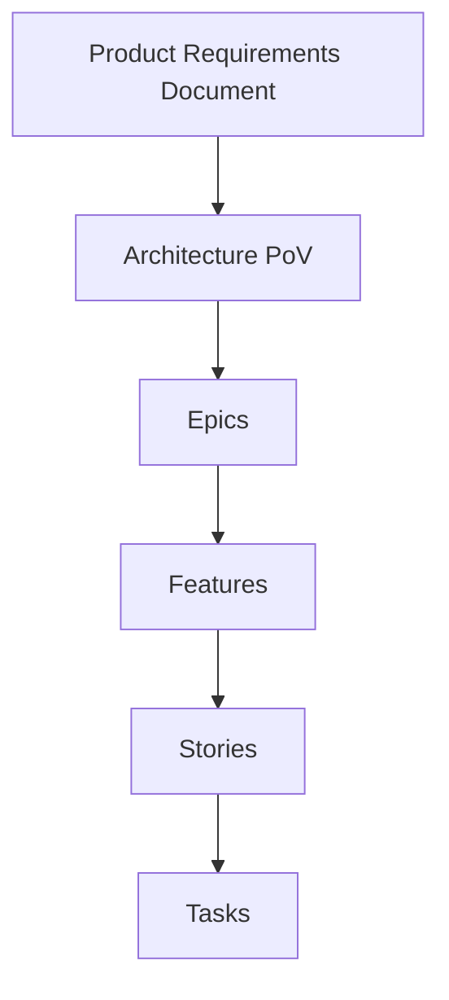

# Agentic Shell

A starting point template for implementing agentic workflows that break down problem statements into actionable components for AI-driven development.

## Purpose

This project provides a structured framework to:

1. Decompose complex problem statements into manageable components
2. Generate supporting context objects for each component
3. Implement solutions through agentic coding techniques

## Project Structure

```
agentic-shell/
├── .cursor/               # Cursor IDE configuration
│   ├── prompts/           # Custom AI prompts
│   ├── rules/             # Workflow rules
│   ├── scratchpad/        # Temporary notes
│   ├── templates/         # Code templates
│   ├── tools/             # Cursor IDE tools
│   └── xnotes/            # Extended notes
├── proj-mgr/              # Project management
│   ├── research/          # Research materials
│   ├── templates/         # Project templates
│   └── tools/             # Project management tools
├── .gitignore             # Git ignore file
├── README.md              # Project documentation
└── repomix.config.json    # Repository configuration
```

## Workflow

### 1. Problem Statement Analysis
- Identify core requirements
- Extract key constraints
- Define success criteria

### 2. Component Decomposition
- Break down problem into logical components
- Identify dependencies between components
- Prioritize implementation order

### 3. Context Object Generation
- Create supporting context for each component
- Define interfaces between components
- Document required resources

### 4. Agentic Implementation
- Leverage AI agents with specific roles:
  - Architect: System design and architecture
  - Developer: Implementation and coding
  - Product Owner: Requirements and acceptance criteria

## Context Document Hierarchy



## Usage

1. Clone this repository to start a new project
2. Define your problem statement in `proj-mgr/research/`
3. Use the specialized agent roles to decompose and implement
4. Track progress through the context objects

## Tools Integration

The project integrates with vibe-tools for AI-assisted development:

- `vibe-tools repo` for repository analysis
- `vibe-tools plan` for implementation planning
- `vibe-tools web` for research assistance

## Getting Started

```bash
git clone https://github.com/yourusername/agentic-shell.git
cd agentic-shell
# Configure your environment variables in ~/.vibe-tools/.env
# Start defining your problem statement
```
