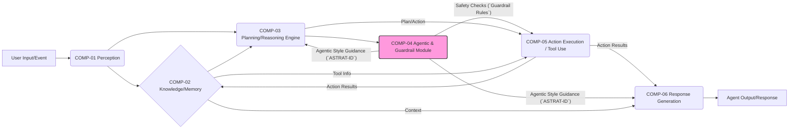

# Architecture Point of View (PoV): `[ARCH-ID]` - `[System Context / Project Focus]`

_**ARCH-ID Format:** SystemContext (e.g., CoreAgent)_

## 0. Document Metadata

| Key                   | Value                                                                |
| --------------------- | -------------------------------------------------------------------- |
| Project               | [Project Name]                                                       |
| PRD                   | [Link to PRD Document](./01-prd-template.md)                         |
| Architecture PoV ID   | `ARCH-[SystemContext]`                                               |
| Title                 | `[Architecture PoV Document Title]`                                  |
| Status                | Draft / Proposed / Accepted / Deprecated                             |
| Version               | 0.0.0                                                                |
| Date                  | [YYYY-MM-DD]                                                         |

---

**Project Context & Traceability**

* **Standard Document Hierarchy:** `PRD -> Architecture PoV (Arch-PoV) -> Epics -> Features -> Stories -> Tasks`
* **Traceability Requirement:** Each subsequent document (e.g., Arch-PoV, Epic, Story) **MUST** link back to its direct parent document using the Markdown format `[Document Title](link-to-document-markdown-file)` and include relevant parent identifiers (e.g., Parent ID, Title) to ensure full context traceability down to the Task level.
* **Hierarchical Numbering:** Items will follow a hierarchical numbering scheme based on their parent (e.g., Epic `1` may contain Features `1.1`, `1.2`; Feature `1.2` may contain Stories `1.2.1`, `1.2.2`).

---

## 1. Introduction & Goals

_**Purpose:** Briefly explain the goal of this document: to translate the high-level requirements and **desired agentic style** from the Product Requirements Document (PRD) [`[PRD Title]`](./01-prd-template.md) into a guiding technical vision for the agent's architecture and implementation._

_**Audience:** Identify the primary audience (e.g., Engineering Leads, Development Teams, Product Managers, QA, Agentic Style Designers)._

_**Architectural Goals:** List the primary desired qualities or capabilities of the architecture, explicitly including the target agentic style and linking to business/product objectives. Use unique IDs. Link to relevant PRD Goal, NFR, or Capability IDs found in `prd.md`. **Crucially, ensure all links in the 'Related PRD Goal(s) / NFR(s)' column strictly follow the Markdown format `[ID](./prd.md#id)`, referencing only specific IDs like `GOAL-XXX`, `NFR-XXX`, or `CAP-XXX`. If no specific, numbered ID from the PRD directly corresponds to the architectural goal, leave the column empty or use 'N/A'. Do not link to general section numbers.**_

| ID            | Goal Description                                                                                                                                      | Related PRD Goal(s) / NFR(s)                                                                                                    | Status   |
| :-------------- | :------------------------------------------------------------------------------------------------------------------------------------------------------ | :-------------------------------------------------------------------------------------------------------------------------------- | :--------- |
| `GOAL-A-[ID]` | Achieve and consistently maintain the target Agentic Style:[`[Reference Definition]`](./01-prd-template.md#5-agent-persona--agentic-style-definition) | [`GOAL-004`](./01-prd-template.md#goal-004), [`NFR-012`](./01-prd-template.md#nfr-012)                                          | Proposed |
| `GOAL-A-[ID]` | [e.g., Support X concurrent interactions with < Y seconds latency]                                                                                    | [`NFR-001`](./01-prd-template.md#nfr-001), [`NFR-002`](./01-prd-template.md#nfr-002), [`NFR-015`](./01-prd-template.md#nfr-015) | Proposed |
| `GOAL-A-[ID]` | [e.g., Enable flexible integration of new tools/APIs]                                                                                                 | [`NFR-011`](./01-prd-template.md#nfr-011)                                                                                       | Proposed |
| `GOAL-A-[ID]` | [e.g., Ensure robust guardrail enforcement and safety]                                                                                                | [`GOAL-005`](./01-prd-template.md#goal-005), [`NFR-009`](./01-prd-template.md#nfr-009)                                          | Proposed |
| `GOAL-A-[ID]` | [e.g., Facilitate effective evaluation and testing of agent behavior and agentic style]                                                               | [`NFR-012`](./01-prd-template.md#nfr-012), [`NFR-013`](./01-prd-template.md#nfr-013)                                            | Proposed |
| ...           | ...                                                                                                                                                   | ...                                                                                                                             | ...      |

_**Scope:** Outline the specific aspects of the agent architecture covered by this PoV._

---

## 2. Requirements Mapping (Agentic Style Focus)

_Briefly link key functional and non-functional requirements from the PRD to specific architectural components or strategies. **Crucially, map PRD requirements related to personality, tone, interaction style, ethical constraints, and safety guardrails to the architectural solutions designed to enforce the defined Agentic Style.**_

| ID            | PRD Requirement Link                                                                               | Description                                            | Architectural Consideration / Proposed Solution (`COMP-ID`, `ASTRAT-ID`)                                                                                                         |
| :-------------- | :--------------------------------------------------------------------------------------------------- | :------------------------------------------------------- | :--------------------------------------------------------------------------------------------------------------------------------------------------------------------------------- |
| `REQMAP-[ID]` | [`PRD Sec 5 (Agentic Definition)`](./01-prd-template.md#5-agent-persona--agentic-style-definition) | [e.g., Target Personality Traits: Empathetic, Concise] | [e.g.,`COMP-04` prompt templates (`ASTRAT-02`), Response filtering rules (`ASTRAT-01`)]                                                                                          |
| `REQMAP-[ID]` | [`PRD Sec 5 (Tone of Voice)`](./01-prd-template.md#5-agent-persona--agentic-style-definition)      | [e.g., Formal language, avoid slang]                   | [e.g., LLM fine-tuning (`ASTRAT-03`), Style guide adherence checks in `COMP-04`]                                                                                                 |
| `REQMAP-[ID]` | [`PRD Sec 6 (Capability)`](./01-prd-template.md#cap-002)                                           | [e.g., CAP-002: Meeting Scheduling]                    | [e.g.,`COMP-03` coordinates `COMP-05`, `COMP-04` formats confirmation messages (`ASTRAT-07`)]                                                                                    |
| `REQMAP-[ID]` | [`PRD Sec 7 (Guardrail)`](./01-prd-template.md#7-behavioral-requirements--guardrails)              | [e.g., MUST NOT provide financial advice]              | [e.g., Input filtering in`COMP-01`, Guardrail checks in `COMP-04` before Action Execution (`COMP-05`), Specific rules in `COMP-04` (`ASTRAT-01`, linked to Decision `DEC-A-ID`)] |
| `REQMAP-[ID]` | [`PRD Sec 8 (NFR)`](./01-prd-template.md#nfr-001)                                                  | [e.g., NFR-001: Response Latency]                      | [e.g., Caching layer (`DEC-A-ID`), Choice of low-latency models (`DEC-A-ID`), Asynchronous processing (`DEC-A-ID`)]                                                              |
| `REQMAP-[ID]` | [`PRD Sec 8 (NFR)`](./01-prd-template.md#nfr-012)                                                  | [e.g., NFR-012: Agentic Consistency]                   | [e.g., Standardized prompt injection (`ASTRAT-02`), Automated agentic evaluation tests (`DEC-A-ID`), Monitoring (`OPS-A-ID`)]                                                    |
| ...           | ...                                                                                                | ...                                                    | ...                                                                                                                                                                              |

---

## 3. Proposed Agent Architecture

_Provide a high-level view of the agent's structure. Describe the main functional blocks and their interactions, emphasizing how the agentic style is integrated._

### 3.1 Conceptual Diagram (e.g., Agent Core Loop)

_(Embed or link to a diagram illustrating the core agent components and flow. Components might include: Perception/Input Processing (`COMP-01`), Knowledge/Memory Management (`COMP-02`), Planning/Reasoning Engine (`COMP-03`), **Agentic & Guardrail Module (`COMP-04`)**, Action Execution/Tool Use (`COMP-05`), Response Generation (`COMP-06`))._

### 3.2 Component Responsibilities

_Define the primary role of each core architectural component. Use unique IDs._

| ID        | Component Name              | Responsibility                                                                                                                                                                             |
| :---------- | :---------------------------- | :------------------------------------------------------------------------------------------------------------------------------------------------------------------------------------------- |
| `COMP-01` | Perception                  | _Handles input processing, intent recognition, entity extraction, initial input filtering/sanitization. Maps to `REQMAP-ID`._                                                              |
| `COMP-02` | Knowledge/Memory            | _Manages short-term context, long-term memory (vector stores, databases), knowledge bases, user profile information. See `DATA-A-ID`, `DATA-A-ID`._                                        |
| `COMP-03` | Planning/Reasoning Engine   | _Determines agent's strategy, selects tools (`COMP-05`), breaks down tasks, manages state. Interacts with `COMP-04` for guidance. See Decision `DEC-A-ID`._                                |
| `COMP-04` | Agentic & Guardrail Module  | _**Crucial Component.** Enforces personality, tone, style guidelines (`ASTRAT-ID`s). Checks against safety/ethical guardrails (`PRD Sec 7`) before actions/responses. Maps to `REQMAP-ID`. |
| `COMP-05` | Action Execution / Tool Use | _Interacts with external APIs, databases, or other systems based on the plan from `COMP-03`. Handles API responses and errors. See Tooling Decision `DEC-A-ID`._                           |
| `COMP-06` | Response Generation         | _Synthesizes final output to the user, incorporating results (`COMP-05`), context (`COMP-02`), and adhering strictly to guidance from `COMP-04` (`ASTRAT-ID`)._                            |
| ...       | ...                         | ...                                                                                                                                                                                        |

### 3.3 Data and Control Flow

_Describe how information and control flow between components (`COMP-ID`s), highlighting interaction points with the Agentic & Guardrail module (`COMP-04`)._

---

## 4. Agentic Style Implementation Strategy

_Detail the technical approach for achieving and maintaining the desired Agentic Style, aligning with [`PRD Sec 5`](./01-prd-template.md#5-agent-persona--agentic-style-definition)._

_Define the key strategies and technical choices for implementing the agent's style. Use unique IDs._

| ID            | Strategy Area                | Details / Approach                                                                                                                                                                                                |
| :-------------- | :----------------------------- | :------------------------------------------------------------------------------------------------------------------------------------------------------------------------------------------------------------------ |
| `ASTRAT-[ID]` | Core Agentic Mechanism       | _[e.g., System prompts, Fine-tuned model, RAG with stylistic examples, Dedicated Agentic LLM, Rule-based filtering, Hybrid approach]. **Justify the choice.** Relates to `DEC-A-ID`._                             |
| `ASTRAT-[ID]` | Prompt Engineering           | _[e.g., Structure of system prompts, Use of few-shot examples, Role definition, Agentic-specific instructions, Handling of negative constraints]. Provide examples. See `COMP-04`._                               |
| `ASTRAT-[ID]` | Model Selection (Agentic)    | _How does the chosen LLM(s) (`DEC-A-ID`) support the target agentic style? Was it fine-tuned?_                                                                                                                    |
| `ASTRAT-[ID]` | Configuration Management     | _How are agentic prompts, rules, and parameters stored, versioned, and updated? [e.g., Config files (`DATA-A-ID`), Database, dedicated service]. See `OPS-A-ID`._                                                 |
| `ASTRAT-[ID]` | Consistency Strategy         | _How is agentic style maintained across different tasks, error states, and long conversations? [e.g., Re-injection of system prompts, State management (`COMP-02`), Standardized error formatting (`ASTRAT-ID`)]_ |
| `ASTRAT-[ID]` | Agentic Style Error Handling | _Specific strategy for maintaining agentic style when reporting errors or limitations. See `PRD Sec 7`._                                                                                                          |
| `ASTRAT-[ID]` | Agentic Style w/ Tools       | _How is the output from tools (`COMP-05`) integrated into responses (`COMP-06`) while maintaining the agent's persona? [e.g., Summarization with agentic style instructions, Formatting rules]._                  |
| ...           | ...                          | ...                                                                                                                                                                                                               |

---

## 5. Key Architectural Decisions & Rationale

_Document significant technical choices beyond the core agentic mechanism. Use unique IDs (`DEC-A-ID`)._

| ID           | Decision Area            | Chosen Approach / Technology                   | Rationale / Alignment with Goals (`GOAL-A-ID`) / Agentic Style (`ASTRAT-ID`)                            | Alternatives Considered (Optional) |
| :------------- | :------------------------- | :----------------------------------------------- | :-------------------------------------------------------------------------------------------------------- | :----------------------------------- |
| `DEC-A-[ID]` | Core LLM(s)              | [e.g., Claude 3.7 Sonnet, Gemini Pro]          | [e.g., Balance of capability, cost, latency (`GOAL-A-ID`), specific strengths in persona (`ASTRAT-ID`)] | [e.g., GPT-4o, Llama 3]            |
| `DEC-A-[ID]` | Planning/Orchestration   | [e.g., LangChain Agents, DSPy, Custom Logic]   | [e.g., Flexibility, Tool integration ease (`GOAL-A-ID`), Debuggability (`GOAL-A-ID`)]                   | [e.g., Semantic Kernel]            |
| `DEC-A-[ID]` | Memory Architecture      | [e.g., Vector DB (Pinecone), Redis Cache]      | [e.g., Scalability (`GOAL-A-ID`), Speed (`GOAL-A-ID`), supports `COMP-02`]                              | [e.g., FAISS, In-memory]           |
| `DEC-A-[ID]` | Tooling / Action Space   | [e.g., Defined OpenAPI specs, Custom Adapters] | [e.g., Ease of integration (`GOAL-A-ID`), Security, Reliability (`GOAL-A-ID`), supports `COMP-05`]      | [e.g., Function calling variants]  |
| `DEC-A-[ID]` | Guardrail Implementation | [e.g., Nemo Guardrails, Custom Regex/Rules]    | [e.g., Robustness (`GOAL-A-ID`), Ease of updating rules, Performance impact, supports `COMP-04`]        | [e.g., LLM-based checks]           |
| `DEC-A-[ID]` | Evaluation Framework     | [e.g., LangSmith, Custom Logging/Testing]      | [e.g., Ability to track agentic metrics (`GOAL-A-ID`), Cost, Integration, supports `NFR-A-ID`]          | [e.g., TruLens, OpenLLMetry]       |
| ...          | ...                      | ...                                            | ...                                                                                                     | ...                                |

---

## 6. Technology Stack

_Summarize the specific technologies chosen, linking to decisions (`DEC-A-ID`) where applicable._

* **Language/Platform:** [e.g., Python, Node.js/TypeScript]
* **Core Frameworks:** [e.g., LangChain (`DEC-A-ID`), FastAPI, Express]
* **LLM Providers:** [e.g., Anthropic, Google AI (`DEC-A-ID`), OpenAI]
* **Vector Database:** [e.g., Pinecone (`DEC-A-ID`), ChromaDB]
* **Caching:** [e.g., Redis (`DEC-A-ID`)]
* **Databases:** [e.g., PostgreSQL (for config/logs)]
* **Infrastructure:** [e.g., AWS Lambda (`OPS-A-ID`), Docker (`OPS-A-ID`), Kubernetes]
* **Monitoring/Logging:** [e.g., Datadog (`OPS-A-ID`), OpenTelemetry]
* **Testing:** [e.g., Pytest, Jest, LangSmith (`DEC-A-ID`)]
* ...

---

## 7. Data Management (Agent Focus)

_Describe how agent-related data is handled. Use unique IDs (`DATA-A-ID`)._

| ID            | Data Type                 | Handling Strategy / Description                                                                                                                                             |
| :-------------- | :-------------------------- | :---------------------------------------------------------------------------------------------------------------------------------------------------------------------------- |
| `DATA-A-[ID]` | Context/Short-Term Memory | _How is conversation history managed (`COMP-02`) and passed? Size limits? Summarization strategy? Relates to `DEC-A-ID`._                                                   |
| `DATA-A-[ID]` | Long-Term Memory          | _Storage format (`DEC-A-ID`), Retrieval strategy (e.g., similarity search parameters), Update mechanism (`COMP-02`). Relates to `DEC-A-ID`._                                |
| `DATA-A-[ID]` | Knowledge Bases           | _Source, Format, Update frequency, Access method (RAG). Used by `COMP-02`. Relates to `DEC-A-ID`._                                                                          |
| `DATA-A-[ID]` | Agentic Configuration     | _Storage (`DEC-A-ID`), Security, Versioning, Access control. Used by `COMP-04`. See `ASTRAT-ID`. Relates to `OPS-A-ID`._                                                    |
| `DATA-A-[ID]` | User Data/PII             | _Handling strategy, Anonymization, Compliance (GDPR/CCPA). Governed by `PRD Sec 7` Guardrails._                                                                             |
| `DATA-A-[ID]` | Logging Data              | _What is logged (prompts, responses, tool calls (`COMP-05`), decisions (`COMP-03`), errors, agentic checks (`COMP-04`))? Format? Retention? Anonymization? See `NFR-A-ID`._ |
| ...           | ...                       | ...                                                                                                                                                                         |

---

## 8. Non-Functional Requirements (NFRs) - Agent & Agentic Style Perspective

_Detail how NFRs are addressed, with specific focus on agent behavior and agentic style. Use unique IDs from PRD where applicable and assign Arch-specific IDs (`NFR-A-ID`)._

| ID           | Category          | Requirement Description (Link to PRD NFR/Goal)                                                                          | Measurement / Target                                                                                                    | Architectural Approach (`COMP-ID`, `DEC-A-ID`, `ASTRAT-ID`, `OPS-A-ID`)                                              |
| :------------- | :------------------ | :------------------------------------------------------------------------------------------------------------------------ | :------------------------------------------------------------------------------------------------------------------------ | :--------------------------------------------------------------------------------------------------------------------- |
| `NFR-A-[ID]` | **Agentic Style** | **Consistency:** Agent maintains defined persona. ([`NFR-012`](./01-prd-template.md#nfr-012))                           | [e.g., Automated Agentic Eval Score (`DEC-A-ID`) > 0.8, Manual Review Pass Rate > 95%]                                  | [e.g., Standardized prompt templates (`ASTRAT-ID`), `COMP-04` enforcement, Regular testing (`DEC-A-ID`)]             |
| `NFR-A-[ID]` | **Agentic Style** | **Guardrail Adherence:** Agent reliably avoids prohibited actions/topics. ([`GOAL-005`](./01-prd-template.md#goal-005)) | [e.g., Guardrail Test Suite (`DEC-A-ID`) Pass Rate = 100%, 0 Critical incidents in monitoring (`OPS-A-ID`)]             | [e.g., Multi-layer checks (`COMP-01`, `COMP-04`), Strict rules in `COMP-04` (`DEC-A-ID`), Monitoring (`OPS-A-ID`)]   |
| `NFR-A-[ID]` | Performance       | [e.g., End-to-end Response Latency (P95)] ([`NFR-001`](./01-prd-template.md#nfr-001))                                   | < X seconds                                                                                                             | [e.g., Model selection (`DEC-A-ID`), Caching (`DEC-A-ID`), Asynchronous processing, Optimized prompts (`ASTRAT-ID`)] |
| `NFR-A-[ID]` | Reliability       | [e.g., Success rate for core tasks] ([`NFR-003`](./01-prd-template.md#nfr-003))                                         | > Y%                                                                                                                    | [e.g., Robust error handling in`COMP-05`, Tool retry mechanisms, Fallback strategies]                                |
| `NFR-A-[ID]` | Scalability       | [e.g., Handle X concurrent users / requests per second] ([`NFR-015`](./01-prd-template.md#nfr-015))                     | Throughput >= X req/sec                                                                                                 | [e.g., Stateless components (`DEC-A-ID`), Autoscaling infra (`OPS-A-ID`), Efficient memory (`DEC-A-ID`)]             |
| `NFR-A-[ID]` | Security          | [e.g., Secure handling of API keys, Prompt injection] ([`NFR-007`](./01-prd-template.md#nfr-007))                       | [e.g., Use Secrets Manager (`DEC-A-ID`), Input sanitization (`COMP-01`), Context separation]                            | [e.g., Vault/Secrets Mgr, Input validation layers (`COMP-01`), Parameterization > concatenation]                     |
| `NFR-A-[ID]` | Observability     | [e.g., Traceability, Agentic metrics, Error logging] ([`NFR-013`](./01-prd-template.md#nfr-013))                        | [e.g., Logs (`DATA-A-ID`) include trace IDs, Agentic scores logged, Alerting (`OPS-A-ID`) on errors/guardrail failures] | [e.g., OpenTelemetry (`DEC-A-ID`), Structured logging, Dashboards (`OPS-A-ID`)]                                      |
| `NFR-A-[ID]` | Maintainability   | [e.g., Modularity, Testability (incl. Agentic module)] ([`NFR-011`](./01-prd-template.md#nfr-011))                      | [e.g., Code coverage > Z%, Ease of updating rules/prompts (`ASTRAT-ID`)]                                                | [e.g., Clear`COMP-ID` boundaries, DI, Unit/Integration tests (`DEC-A-ID`)]                                           |
| `NFR-A-[ID]` | Cost              | [e.g., Average cost per interaction / LLM token usage]                                                                  | < $X per interaction                                                                                                    | [e.g., Model routing (`DEC-A-ID`), Caching (`DEC-A-ID`), Prompt optimization (`ASTRAT-ID`), Monitoring (`OPS-A-ID`)] |
| ...          | ...               | ...                                                                                                                     | ...                                                                                                                     | ...                                                                                                                  |

---

## 9. Deployment & Operations

_Outline the deployment strategy and operational considerations. Use unique IDs (`OPS-A-ID`)._

| ID           | Area                     | Details                                                                                                                     |
| :------------- | :------------------------- | :---------------------------------------------------------------------------------------------------------------------------- |
| `OPS-A-[ID]` | Deployment Strategy      | _[e.g., CI/CD pipeline, Blue/Green or Canary deployments, Containerization (Docker), Serverless (Lambda)]. See `DEC-A-ID`._ |
| `OPS-A-[ID]` | Infrastructure           | _[e.g., Cloud provider (AWS/GCP/Azure), Kubernetes cluster, Serverless functions]. See Tech Stack (Sec 6)._                 |
| `OPS-A-[ID]` | Configuration Deployment | _How are agent configs (`DATA-A-ID`), prompts (`ASTRAT-ID`), and agentic rules (`ASTRAT-ID`) deployed alongside code?_      |
| `OPS-A-[ID]` | Model Deployment/Updates | _Strategy for updating base models or fine-tuned models (`DEC-A-ID`)._                                                      |
| `OPS-A-[ID]` | Monitoring & Alerting    | _Key metrics (`NFR-A-ID`) to monitor (latency, errors, cost, **agentic scores**, **guardrail hits**), Alerting thresholds._ |
| `OPS-A-[ID]` | Rollback Strategy        | _Plan for rolling back failed deployments (code, config (`OPS-A-ID`), models (`OPS-A-ID`))._                                |
| ...          | ...                      | ...                                                                                                                         |

---

## 10. Risks and Mitigation (Agent & Agentic Style Focus)

_Identify major architectural risks, particularly those related to agent behavior and agentic style. Use unique IDs (`RISK-A-ID`)._

| ID            | Category                   | Risk Description                                                                          | Likelihood | Impact | Mitigation Strategy (`GOAL-A-ID`, `NFR-A-ID`, `DEC-A-ID`, `ASTRAT-ID`, `OPS-A-ID`)                                                                                                        |
| :-------------- | :--------------------------- | :------------------------------------------------------------------------------------------ | :----------- | :------- | :------------------------------------------------------------------------------------------------------------------------------------------------------------------------------------------ |
| `RISK-A-[ID]` | **Agentic Style/Behavior** | **Agentic Drift:** Agent personality changes undesirably.                                 | Medium     | High   | [e.g., Regular automated agentic testing (`DEC-A-ID`), Monitoring agentic metrics (`OPS-A-ID`, `NFR-A-ID`), Prompt/Rule refresh (`ASTRAT-ID`), Model retraining/fine-tuning (`OPS-A-ID`)] |
| `RISK-A-[ID]` | **Agentic Style/Behavior** | **Inconsistent Style:** Agent exhibits different personalities depending on the task.     | Medium     | Medium | [e.g., Standardized agentic style injection (`ASTRAT-ID`), Testing across diverse scenarios (`DEC-A-ID`), Centralized `COMP-04`]                                                          |
| `RISK-A-[ID]` | **Agentic Style/Behavior** | **Guardrail Failure:** Agent bypasses safety checks or exhibits harmful behavior.         | Low        | High   | [e.g., Multi-layered guardrails (`DEC-A-ID`, `COMP-04`), Rigorous testing (`DEC-A-ID`), Continuous monitoring (`OPS-A-ID`, `NFR-A-ID`), Rapid incident response plan]                     |
| `RISK-A-[ID]` | **Agentic Style/Behavior** | **Hallucination / Incorrect Info:** Agent provides plausible but false information.       | Medium     | High   | [e.g., RAG (`DEC-A-ID`), Fact-checking steps (`COMP-04`), Confidence scoring, Allow agent to state uncertainty]                                                                           |
| `RISK-A-[ID]` | **Agentic Style/Behavior** | **Off-Brand Responses:** Agent uses language/tone inconsistent with brand identity.       | Medium     | Medium | [e.g., Strict`COMP-04` rules (`ASTRAT-ID`), Negative constraints in prompts (`ASTRAT-ID`), Response filtering]                                                                            |
| `RISK-A-[ID]` | Technical                  | **LLM API Dependency:** Outages, changes, deprecation of external LLM APIs (`DEC-A-ID`).  | Medium     | High   | [e.g., Abstraction layer for LLMs, Fallback models, Contractual agreements]                                                                                                               |
| `RISK-A-[ID]` | Technical                  | **Scalability Bottleneck:** Specific component (`COMP-ID`) fails under load (`NFR-A-ID`). | Medium     | Medium | [e.g., Load testing (`DEC-A-ID`), Perf optimization, Asynchronous design (`DEC-A-ID`), Scalable infra (`OPS-A-ID`)]                                                                       |
| `RISK-A-[ID]` | Technical                  | **Tool Integration Failure:** External APIs (`DEC-A-ID`) change or become unreliable.     | Medium     | Medium | [e.g., Robust error handling in`COMP-05`, Monitoring (`OPS-A-ID`), Adapters for easy updates]                                                                                             |
| `RISK-A-[ID]` | Cost                       | **Uncontrolled LLM Costs:** High token usage (`NFR-A-ID`).                                | Medium     | High   | [e.g., Cost monitoring/alerting (`OPS-A-ID`), Prompt optimization (`ASTRAT-ID`), Caching (`DEC-A-ID`), Model routing (`DEC-A-ID`), Usage limits]                                          |
| ...           | ...                        | ...                                                                                       | ...        | ...    | ...                                                                                                                                                                                       |

---

## 11. Open Questions

_List key architectural or technical questions remaining to be resolved. Use unique IDs (`Q-A-ID`)._

| ID         | Question                                                                                     | Status (Open/Answered) | Owner       | Due Date |
| :----------- | :--------------------------------------------------------------------------------------------- | :----------------------- | :------------ | :--------- |
| `Q-A-[ID]` | [e.g., Final choice between LLM A vs LLM B (`DEC-A-ID`) for the Agentic module (`COMP-04`)?] | Open                   | [Name/Team] | [Date]   |
| `Q-A-[ID]` | [e.g., Detailed schema for long-term memory vector store (`DATA-A-ID`, `DEC-A-ID`)?]         | Open                   | [Name/Team] | [Date]   |
| `Q-A-[ID]` | [e.g., Specific metrics and thresholds for automated agentic evaluation (`NFR-A-ID`)?]       | Open                   | [Name/Team] | [Date]   |
| `Q-A-[ID]` | [e.g., Optimal strategy for handling conflicting info from knowledge sources (`DATA-A-ID`)?] | Open                   | [Name/Team] | [Date]   |
| ...        | ...                                                                                          | ...                    | ...         | ...      |

---

## 12. Glossary

_Definitions of key terms specific to this agent and its architecture. Use unique IDs (`GLOSS-A-ID`)._

| ID             | Term                        | Definition                                                                                              |
| :--------------- | :---------------------------- | :-------------------------------------------------------------------------------------------------------- |
| `GLOSS-A-[ID]` | Agentic Module (`COMP-04`)  | _[e.g., Component responsible for enforcing agent style (`ASTRAT-ID`) and guardrails (`PRD Sec 7`).]_   |
| `GLOSS-A-[ID]` | Planning Engine (`COMP-03`) | _[e.g., Component responsible for determining agent strategy and tool use (`COMP-05`).]_                |
| `GLOSS-A-[ID]` | Agentic Consistency Score   | _[e.g., Metric used to evaluate how consistently the agent maintains its style (`NFR-A-ID`).]_          |
| `GLOSS-A-[ID]` | Guardrail                   | _[e.g., A rule or constraint designed to prevent undesirable agent behavior (defined in `PRD Sec 7`).]_ |
| ...            | ...                         | ...                                                                                                     |

---

## 13. Document History

| Version | Date | Author(s) | Changes |
| :-------- | :----- | :---------- | :-------- |
| ...     | ...  | ...       | ...     |
